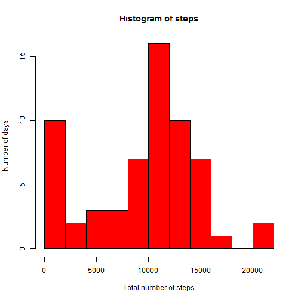
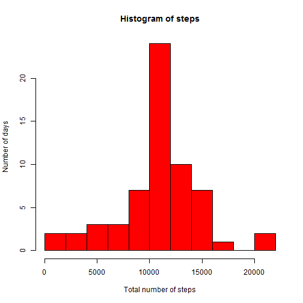
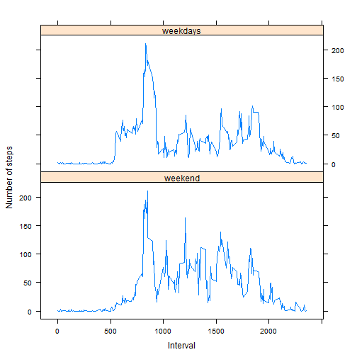

This document reflects the work for Peer Assesment 1 of Reproducible Research course on [coursera.org](http://www.coursera.org/ "Coursera").

## Loading and preprocessing the data

This is the code used to load and pre-process the data


```r
##import libraries
library("dplyr", quietly = TRUE)
```

```
## 
## Attaching package: 'dplyr'
## 
## The following object is masked from 'package:stats':
## 
##     filter
## 
## The following objects are masked from 'package:base':
## 
##     intersect, setdiff, setequal, union
```

```r
library("reshape2", quietly = TRUE)
library("lubridate", quietly = TRUE)
library("lattice", quietly = TRUE)

##load the data from csv file
activity <- tbl_df(data = read.csv("activity.csv"))

##melt data set to be able to calculate measures of steps based on date and interval
m_activity <- melt(activity,id.vars = c("date","interval"))
```


## What is mean total number of steps taken per day?

Histogram of the total number of steps per day.


```r
##cast molted dataset to calculate the total number of steps per day
c_activity <- dcast(m_activity, date ~ variable, sum, na.rm = TRUE)

##histogram of total number of steps per day
with(c_activity, hist(steps, breaks = 12, col = "red", xlab="Total number of steps", ylab = "Number of days"))
```

 

Mean of steps per day:

```r
##Calculate the mean of steps per day
steps_mean <- with(c_activity, mean(steps, na.rm = TRUE))
print(steps_mean)
```

```
## [1] 9354
```

Median of steps per day:

```r
##calculate median of steps per day
steps_median <- with(c_activity, median(steps, na.rm = TRUE))
print(steps_median)
```

```
## [1] 10395
```


## What is the average daily activity pattern?

Average number of steps per time interval

```r
##cast molten dataset to calculate the average number of steps per interval across all days
d_activity <- dcast(m_activity, interval ~ variable, mean, na.rm = TRUE)
##transform interval military notation to a time variable
p_activity <- mutate(d_activity, interval = parse_date_time(d_activity$interval, order=c("%H:%M","%M")))

##plot the average number of steps per interval
with(p_activity,plot(interval,steps, type = "l", xlab="5-minute interval (time)", ylab="Number of steps", main="Average number of steps per time interval"))
```

 


5-minute interval with the maximum number of steps in average:

```r
##get the 5-minute interval with the maximum number of steps in average
d_activity[d_activity$steps == max(d_activity$steps),]$interval
```

```
## [1] 835
```


## Imputing missing values

Total number of missing values:

```r
sum(is.na(activity$steps))
```

```
## [1] 2304
```

We fill the NA values with the average number of steps across all days for the corresponding 5-minutes interval

```r
##fill NA values with the average number of steps across all days for thet 5-minutes interval

##merge original dataset with dataset that contains the average number of steps per interval
merged_activity <- merge(activity,d_activity, by="interval")

##replace NA with the average number of steps for that interval
f_activity <- mutate(merged_activity, steps = ifelse(is.na(steps.x),steps.y,steps.x))

##remove  colums created with the merge
f_activity <- select(f_activity, c(-steps.x,-steps.y))
```

Histogram of total number of steps per day with NA values replaced with the average number of steps for the interval:

```r
##melt down the dataset to calculate measures of steps based on date and interval
m_activity <- melt(f_activity,id.vars = c("date","interval"))

##cast the molten dataset to calculate the total number of steps per day
c_activity <- dcast(m_activity, date ~ variable, sum, na.rm = TRUE)

##histogram of total number of steps per day
with(c_activity, hist(steps, breaks = 12, col = "red", xlab="Total number of steps", ylab = "Number of days"))
```

 

Mean of number of steps per day

```r
steps_mean <- with(c_activity, mean(steps, na.rm = TRUE))
print(steps_mean)
```

```
## [1] 10766
```

Median of number of steps per day

```r
steps_median <- with(c_activity, median(steps, na.rm = TRUE))
print(steps_median)
```

```
## [1] 10766
```

Filling the missing values with the average number of steps per interval, rises up both mean an media, and makes the value for both equal.


## Are there differences in activity patterns between weekdays and weekends?

Time series of avarage number of steps per 5-minutes interval on weekdays and on weekend:


```r
##calculate day of the week
w_activity <- mutate(m_activity, weekdays = as.factor(weekdays(parse_date_time(m_activity$date, order=c("%y-%m-%d")))))
w_activity <- select(w_activity,-date)

##convert factor levels to only two factors weekdays and weekend
levels(w_activity$weekdays) <- c("weekend","weekdays","weekdays","weekdays","weekdays","weekdays","weekend")

##plot the results
t_activity <- dcast(w_activity, interval + weekdays ~ variable, mean)
xyplot(steps ~ interval | weekdays, data = t_activity, type="l", layout=c(1,2), xlab="Interval", ylab="Number of steps")
```

 


